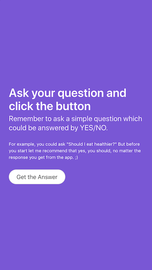

# Ultimate Decision Maker


UDM (Ultimate Decision Maker) is a simple app to play around. It helps you (in a funny way) to take banal decisions without having to think too much.

You just have to think on a question you want the answer for:



Click on the button "Get the Answer" and *Voilá*. You are going to have the problem solved. ;)

**Disclaimer**: UDM is not responsible for the decisions you finally make. Be aware that this is just a funny way to play around with trivial decisions like "Should we go to McDonald's for dinner?".

## Try it online!

Ultimate Decision Maker can be accessed by pointing a web browser at https://s3rrot.github.io/ultimate-decision-maker/

## Building and Running UDM Locally

1. Clone the source code

```
git clone https://github.com/s3rrot/ultimate-decision-maker.git
```

2. Install development dependencies 

```
yarn install
```

3. Run a local development server (including hot-reload)

```
yarn serve
```

Ultimate Decision Maker is now running, and can be accessed by pointing a web browser at http://localhost:8080/

## License

The Ultimate Decision Maker is available under the [MIT License](https://opensource.org/licenses/MIT) and uses the https://yesno.wtf/#api :)
